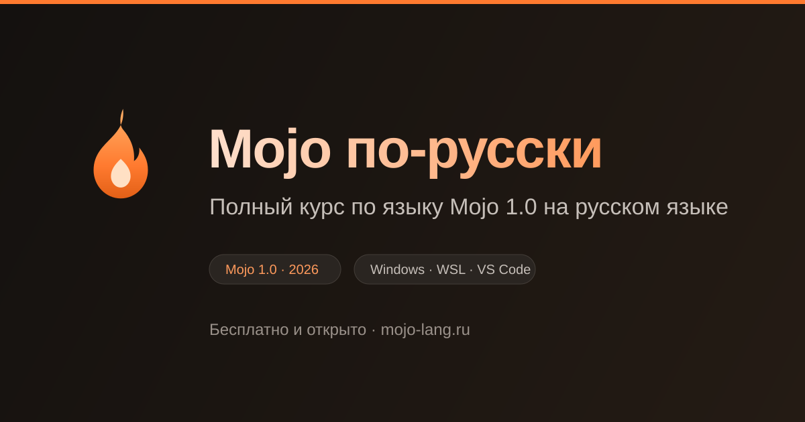

<div align="center">



# Mojo по-русски

**Бесплатный курс по языку программирования Mojo 1.0 на русском языке.**
От «у меня Windows и я ничего не понимаю» до собственной библиотеки с SIMD.

### [📖 Читать курс →](https://mojo-lang.ru/)

[](https://mojolang.org/)
[](https://github.com/V-Moskalenko/mojo-ru/actions/workflows/deploy.yml)
[](https://github.com/V-Moskalenko/mojo-ru/actions/workflows/check-examples.yml)
[](LICENSE-CONTENT)

</div>

---

## Что это

Mojo — язык от создателя LLVM и Swift Криса Латтнера: синтаксис Python,
скорость компилируемого языка, безопасная работа с памятью без сборщика
мусора. В августе 2026 вышла версия 1.0 — первая со стабильным API,
на который уже можно опираться.

Этот курс объясняет язык **по-русски и с нуля**, опираясь на официальную
документацию Modular. Ничего платного, никакой регистрации: открываете
и читаете.

## С чего начать

| Вы                                | Начните отсюда                                                                                       |
| --------------------------------- | ---------------------------------------------------------------------------------------------------- |
| 💻 Работаете на Windows           | [Установка через WSL](https://mojo-lang.ru/install/windows-wsl/) — самая подробная глава курса       |
| 🍏 Mac на Apple Silicon или Linux | [Установка через uv](https://mojo-lang.ru/install/macos-linux/) — десять минут                       |
| 🐍 Пишете на Python               | [Первая программа](https://mojo-lang.ru/basics/first-program/) — разбор построчно                    |
| 🤔 Ещё присматриваетесь           | [Зачем нужен Mojo](https://mojo-lang.ru/start/why-mojo/) — честное сравнение с Python, C++ и Rust    |
| 📰 Читали статьи про Mojo раньше  | [Устаревшие конструкции](https://mojo-lang.ru/python-to-mojo/outdated/) — что сломалось к версии 1.0 |

## Попробовать прямо сейчас

На Linux, macOS (Apple Silicon) или в WSL:

```bash
curl -LsSf https://astral.sh/uv/install.sh | sh   # менеджер пакетов
uv init hello-mojo && cd hello-mojo
uv add mojo                                        # сам Mojo
echo 'def main():
    print("Привет, Mojo!")' > hello.mojo
uv run mojo hello.mojo
```

Если что-то пошло не так — есть
[справочник ошибок](https://mojo-lang.ru/install/troubleshooting/)
на два десятка сообщений, от кодов WSL до `Illegal instruction`.

## Что уже написано

**Готово к чтению:**

- Зачем нужен Mojo · Первая программа · Устаревшие конструкции · Словарь терминов
- Раздел «Установка» целиком: системные требования, Windows через WSL,
  macOS и Linux, настройка VS Code, удалённая разработка, диагностика проблем

**В работе:** базовый синтаксис, владение значениями, метапрограммирование,
SIMD и производительность, взаимодействие с Python и C, практические проекты.

Всего в плане 9 разделов и 54 главы — структура целиком видна
[на сайте](https://mojo-lang.ru/) в боковом меню: у ненаписанных
глав стоит пометка «в работе», но их план уже зафиксирован.

## Почему этот курс

**Русский язык, а не машинный перевод.** Термины подобраны осознанно
и используются одинаково на всех страницах. При первом упоминании — русский
вариант и оригинал в скобках, чтобы вы могли гуглить на английском
и не теряться в официальной документации. Есть
[словарь](https://mojo-lang.ru/reference/glossary/).

**Windows — полноценная платформа.** Mojo не работает в Windows напрямую,
только через WSL. Здесь это не сноска мелким шрифтом, а отдельная большая
глава: WSL2, uv, VS Code Remote, SSH-ключи и разбор типичных ошибок.

**Код, который компилируется.** Каждый пример лежит в репозитории отдельным
файлом и прогоняется на настоящем компиляторе Mojo в CI — раз в неделю
и при каждом изменении. Под примерами показан реальный вывод программы.

**Опора на первоисточник.** Теория сверена с официальным мануалом Modular.
Конструкции, устаревшие к версии 1.0 — `fn`, `let`, `inout`, `@value` —
отмечены явно: в интернете полно статей, где они ещё живы.

## Нашли ошибку или что-то непонятно

- **Ошибка в тексте или коде** — внизу каждой страницы сайта есть ссылка
  «Редактировать страницу», она ведёт прямо в редактор GitHub.
- **Не хватает темы, или объяснение не зашло** —
  [заведите issue](https://github.com/V-Moskalenko/mojo-ru/issues/new/choose),
  есть готовые шаблоны. Главы пишутся в порядке спроса, так что это реально работает.
- **Вопрос про сам язык** — [форум Modular](https://forum.modular.com/),
  там отвечают в том числе разработчики Mojo.

Курс делается открыто, и любая правка приветствуется — от опечатки
до целой главы. Как всё устроено внутри, описано в
[CONTRIBUTING.md](CONTRIBUTING.md).

<details>
<summary><b>Собрать сайт локально</b></summary>

Нужен Node.js 22+.

```bash
git clone https://github.com/V-Moskalenko/mojo-ru.git
cd mojo-ru
npm install
npm run dev      # http://localhost:4321/
```

Остальные команды:

```bash
npm run build           # сборка в dist/ + проверка всех внутренних ссылок
npm run format          # причесать исходники (тексты глав не трогает)
npm run stubs           # создать недостающие страницы-заглушки по плану курса
npm run examples:check  # прогнать примеры на настоящем Mojo (нужен Linux/macOS/WSL)
npm run og              # пересобрать картинку для соцсетей
```

Структура репозитория:

```
src/
  content/docs/       главы курса (.mdx): корень — русская версия, en/ — английская
  components/         PyMojo, Result, Quiz, CompilerError, Hero, Head, Footer
  styles/theme.css    дизайн-система
  grammars/           TextMate-грамматика Mojo для подсветки кода
  plugins/, utils/    базовый путь для ссылок при публикации на GitHub Pages
examples/             примеры кода: .mojo рядом с .out (ожидаемый вывод)
scripts/              генератор заглушек, проверка примеров, скриншоты, превью
.github/workflows/    публикация сайта и еженедельная проверка примеров
templates/hello-mojo  готовый шаблон проекта для читателей (в том числе Codespaces)
```

Сайт собран на [Astro](https://astro.build/) +
[Starlight](https://starlight.astro.build/) и публикуется на GitHub Pages
автоматически при пуше в `main`.

</details>

## Лицензии

- Тексты курса — [CC BY-NC-SA 4.0](LICENSE-CONTENT): читайте, копируйте,
  переводите и дорабатывайте со ссылкой на источник. Нельзя одно —
  зарабатывать на них; производные работы остаются на тех же условиях
- Код сайта и примеров — [Apache 2.0](LICENSE-CODE): его можно брать
  куда угодно, включая рабочие проекты. Примеры для того и написаны
- TextMate-грамматика Mojo — Apache 2.0, из
  [modular/vscode-mojo](https://github.com/modular/vscode-mojo)

## Источники

- [Официальный мануал Mojo](https://mojolang.org/docs/manual/) — основной источник фактуры
- [Mojo Miji](https://mojo-lang.com/miji/) Юйхао Чжу — референс по структуре и подаче
  материала. Книга под лицензией CC BY-NC-ND 4.0, поэтому её текст здесь
  **не переводится и не заимствуется**: используются только идеи организации курса

<div align="center">

Если курс оказался полезен — поставьте ⭐ и расскажите тем, кому он тоже пригодится.

</div>
